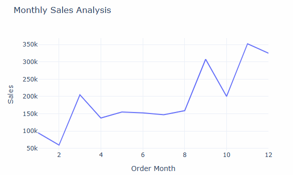
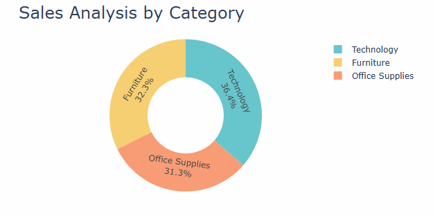
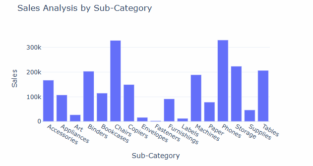
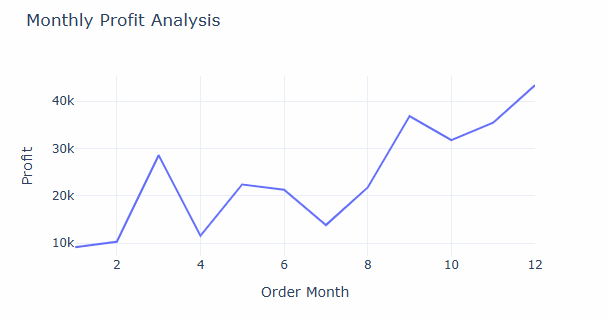
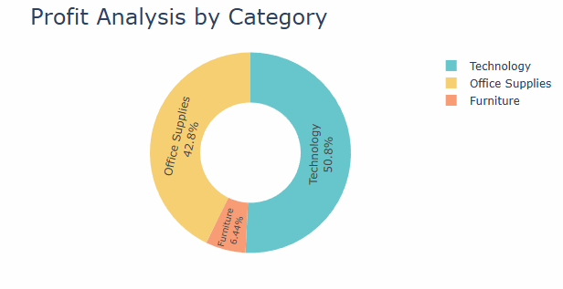
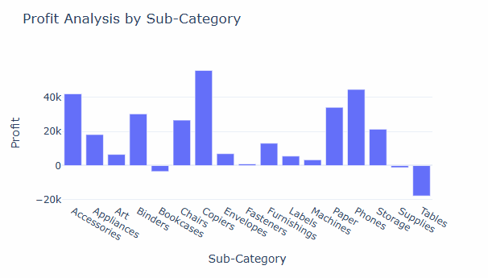
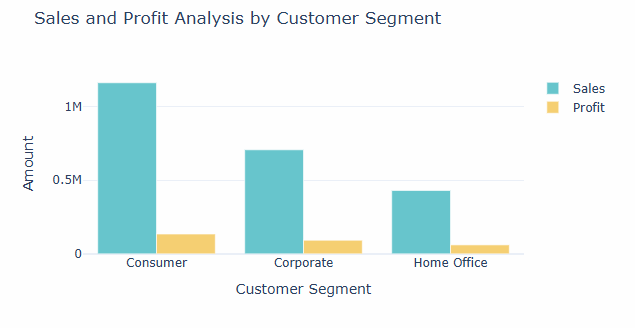

# 📊 E-commerce Sales Analysis using Python

An end-to-end **Exploratory Data Analysis (EDA)** project that analyzes an e-commerce retail dataset using **Python, Pandas, and Plotly**. The project focuses on identifying sales trends, profitability patterns, customer segment performance, and product category insights through interactive data visualization.

---

## 📖 Project Overview

Businesses generate thousands of sales transactions every day, but raw transactional data alone cannot support strategic decision-making. This project demonstrates how data analytics can transform raw retail data into meaningful business insights.

Using Python and powerful data analysis libraries, this project explores historical sales data to understand monthly sales trends, product category performance, customer purchasing behavior, and profit distribution. Interactive visualizations are created using Plotly to present insights in an intuitive and business-friendly format.

The project follows a complete data analysis workflow, including data loading, preprocessing, feature engineering, exploratory data analysis (EDA), and visualization.

---

## 🎯 Business Problem Statement

The project aims to answer the following business questions:

- Calculate monthly sales and identify the highest and lowest sales months.
- Analyze sales across different product categories.
- Analyze sales performance by product sub-category.
- Determine monthly profit trends and identify the highest profit month.
- Compare profit across product categories and sub-categories.
- Analyze sales and profit generated by different customer segments.
- Calculate the Sales-to-Profit Ratio to evaluate business efficiency.

---

## 🛠️ Technologies Used

| Technology | Purpose |
|------------|---------|
| Python | Data Analysis |
| Pandas | Data Cleaning & Manipulation |
| Plotly Express | Interactive Visualizations |
| Plotly Graph Objects | Advanced Charts |
| Jupyter Notebook | Development Environment |

---

## 📂 Dataset

**Dataset:** Sample Superstore Dataset

The dataset contains retail sales transactions including:

- Order Date
- Ship Date
- Customer Segment
- Product Category
- Product Sub-Category
- Sales
- Profit
- Region
- State
- Customer Information

---

# ⚙️ Project Workflow

## 1️⃣ Data Loading

The retail sales dataset is imported into Python using the Pandas library. The data is loaded from a CSV file and stored in a DataFrame for analysis.

---

## 2️⃣ Data Exploration

Before performing analysis, the dataset is explored to understand its overall structure and quality.

This includes:

- Understanding dataset dimensions
- Inspecting column names
- Checking data types
- Generating descriptive statistics
- Identifying missing values

---

## 3️⃣ Data Preprocessing

The raw dataset is cleaned and prepared for analysis by performing several preprocessing steps.

These include:

- Converting Order Date into datetime format
- Extracting Month
- Extracting Year
- Extracting Day of Week
- Creating new time-based features for trend analysis

---

## 4️⃣ Exploratory Data Analysis (EDA)

The project performs multiple analyses to answer business questions regarding sales performance, profitability, and customer behavior.

---

# 📊 Monthly Sales Analysis

Monthly sales are analyzed to identify seasonal sales patterns, peak business periods, and months with lower sales performance. This analysis helps businesses understand customer purchasing behavior throughout the year and supports better inventory planning and demand forecasting.



---

# 📊 Sales Analysis by Category

This analysis compares sales generated by the major product categories. It helps identify which categories contribute the highest revenue and which categories require additional business attention or marketing efforts.



---

# 📊 Sales Analysis by Sub-Category

A detailed product-level analysis is performed to understand how each sub-category contributes to total sales. This allows businesses to identify best-selling products and products with lower customer demand.



---

# 📈 Monthly Profit Analysis

Monthly profit trends are analyzed to evaluate business profitability throughout the year. Unlike sales analysis, profit analysis provides deeper insight into financial performance by highlighting periods of higher or lower profit generation.



---

# 📊 Profit Analysis by Category

This visualization compares profit generated by each major product category. It helps determine whether high-selling categories also generate high profits and supports strategic business planning.



---

# 📊 Profit Analysis by Sub-Category

Sub-category profit analysis identifies products that contribute positively to profitability as well as products that generate losses. These insights can support pricing strategies and inventory optimization.



---

# 📊 Sales & Profit Analysis by Customer Segment

Customer segment analysis compares total sales and profit across Consumer, Corporate, and Home Office customer groups. Understanding customer segment performance enables businesses to identify their most valuable customers and improve customer relationship strategies.



---

# 💡 Key Business Insights

- Sales performance varies throughout the year, with stronger sales observed during the final months, indicating seasonal purchasing trends.
- Technology products contribute the largest share of total sales, making them the strongest revenue-generating category.
- Technology also generates the highest overall profit, demonstrating strong profitability in addition to high sales performance.
- Product sub-category analysis reveals that some products generate high sales while contributing relatively lower profits, highlighting the importance of evaluating profitability alongside revenue.
- Customer segment analysis shows that Consumer customers generate the highest sales and profit among all customer groups.
- The Sales-to-Profit Ratio provides an additional business metric for evaluating profitability efficiency across customer segments.

---

# 💼 Skills Demonstrated

- Python Programming
- Pandas
- Data Cleaning
- Data Preprocessing
- Feature Engineering
- Exploratory Data Analysis (EDA)
- Data Aggregation
- Data Visualization
- Business Analytics
- Business Intelligence
- Plotly
- Analytical Thinking

---

# 📁 Project Structure

```text
ecommerce-sales-analysis-python/
│
├── dataset/
│   └── Sample - Superstore.csv
│
├── images/
│   ├── monthly-sales-analysis.png
│   ├── sales-by-category.png
│   ├── sales-by-subcategory.png
│   ├── monthly-profit-analysis.png
│   ├── profit-by-category.png
│   ├── profit-by-subcategory.png
│   └── customer-segment-analysis.png
│
├── ecommerce_sales_analysis.ipynb
├── README.md
└── requirements.txt
```

# 📌 Requirements

```
pandas
plotly
jupyter
```

---

# 👤 Author
**Nasrin Khatoon**
Aspiring Data Analyst passionate about transforming raw data into actionable business insights through Python, SQL, Power BI, and data visualization.

